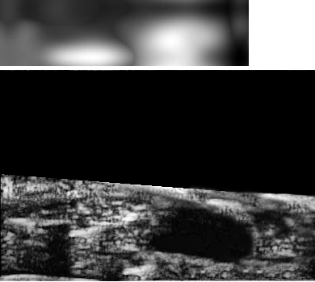

# Project 1 (Tactile-Ultrasound (US) signal fusion) dataset

## Summary
This repository contains a dataset of tactile-ultrasound imaging. It is a type of intraoperative imaging under development for imaging the deflated lung during minimally
invasive surgery. The root training dataset directory named as **"parent TC-US_orgShape_images (for training)"** contains a series of paired and complementary tactile and US images. 
To build deep learning models for binary classification of these images into tumor and nontumor, **four** types of datasets are derived from the parent dataset. The following screen 
shot provides a better perspective of a tactile-US image in 3D.

At the acquisition time, the tactile and the US images are aligned by the imaging device and could be visualized in 2D as following - 

Note that in the 3D image where the tactile image plane intersects the US image plane, the US image area above the line of intersection is irrelevant and is therefore blancked out.

## Dataset management: 
### 1. 
- Directory **only_TC_orgShape_signal (for training)** contains a **train** and a **test** directory. Each of them contains sub-directories **tumor** and **nontumor**. These
sub-directories are also the labels of the manually identified tactile images converted into signals. Here, a 2D image is converted into intensity signals in row-wise manner and is 
saved as a numerical 2D matrix in a .txt file.

### 2. 
- Directory **only_US_orgShape_signal (for training)** has the same organizational structure as previous, however, it contains only the US image-based data

### 3. 
- Directory **TC-US_orgShape_signal (for training)** has the same organizational structure as previous, however, it contains the converted data from both the tactile and US images.

### 4. 
- Directory **Tact-US_dataset_v3.0 (for training)** has the same organizational structure as previous, however, it contains the filtered signal pairs. The design and implementation
of this filter is the major contribution for the use case of the parent dataset.

### 5. 
- Directory **Experimental_data** contains unseen images acquired from more experiments and their corresponding signal converts.

### 6. 
- Directory **Experimental_Data_Signal_series** contains the unseen test sets from all the previous categories.