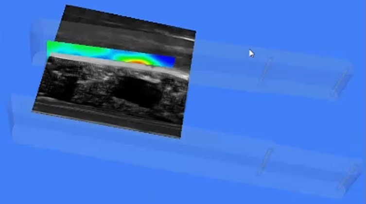
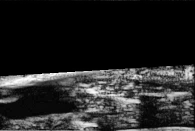

# Project 1 (Tactile-Ultrasound (US) signal fusion) dataset

These are the different training and testing datasets organized to generate the tactile-US signal sets.

1. Each of all the folders in this repository has two sub-folders labeled as "tumor" and "nontumor". These are also labels to the tactile-US images stored in them.
2. A tactile-US image is visualized as following in 3D. 

3. At the time of acquisition, the tactile and the US images are aligned and visualized in 2D as following.

4. Notice that in the 3D image where the tactile image plane intersects the US image plane, the US image area above the line of intersection is irrelevant and is 
therefore blancked out.

